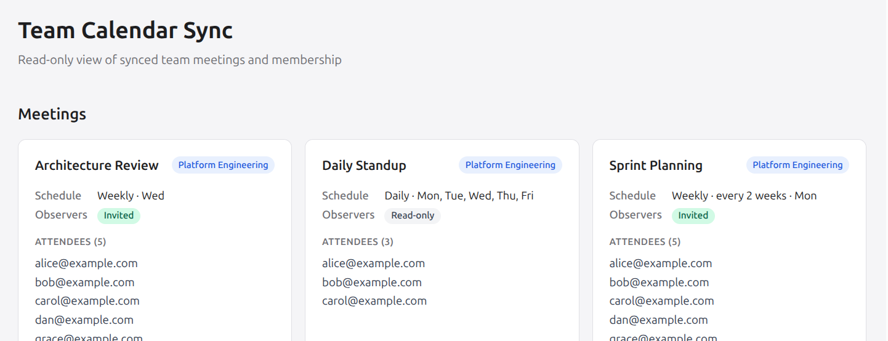

# Paper Prototypes - Team Calendar Sync

> [!WARNING]
> **AI-authored:** This change was autonomously planned and implemented by an AI software factory from a human-authored specification, with possible subsequent human review or modification.

> [!WARNING]
> This experiment is effectively abandoned. The generated material is retained primarily as a research artifact.

A prototype that derives recurring meeting attendance from changing team membership and observer relationships.

```sh
make serve
```



## Notes

- Neat, but ultimately throw-away
